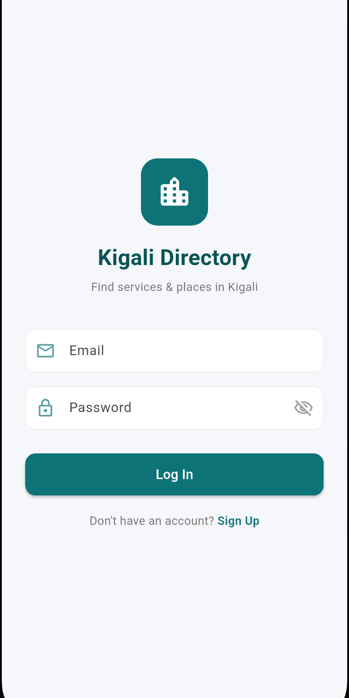
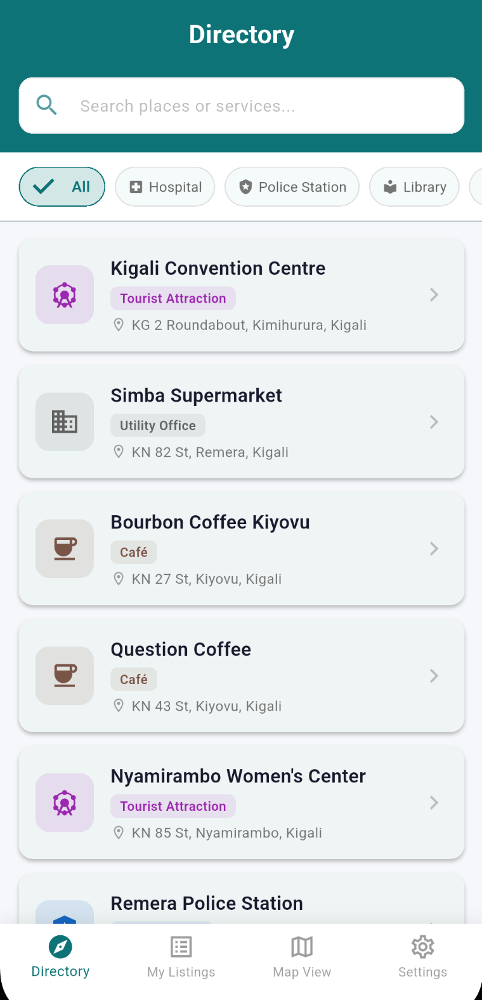
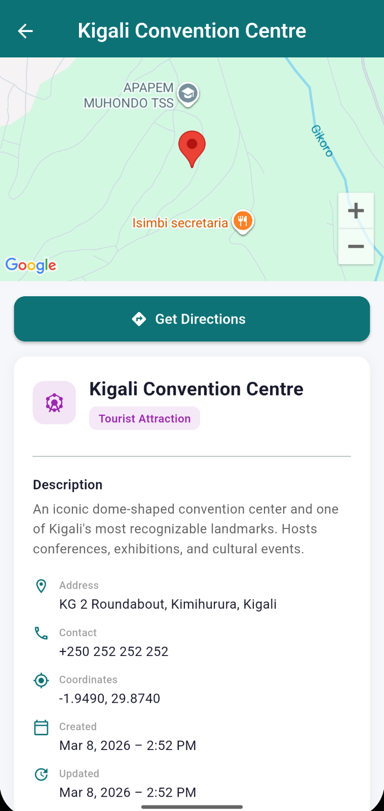
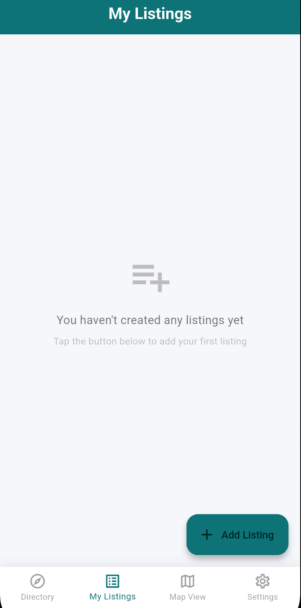
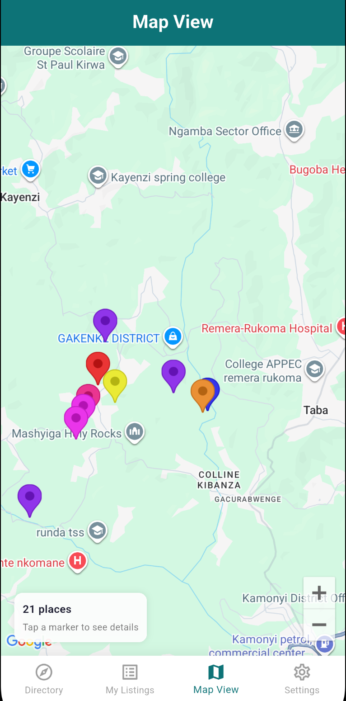
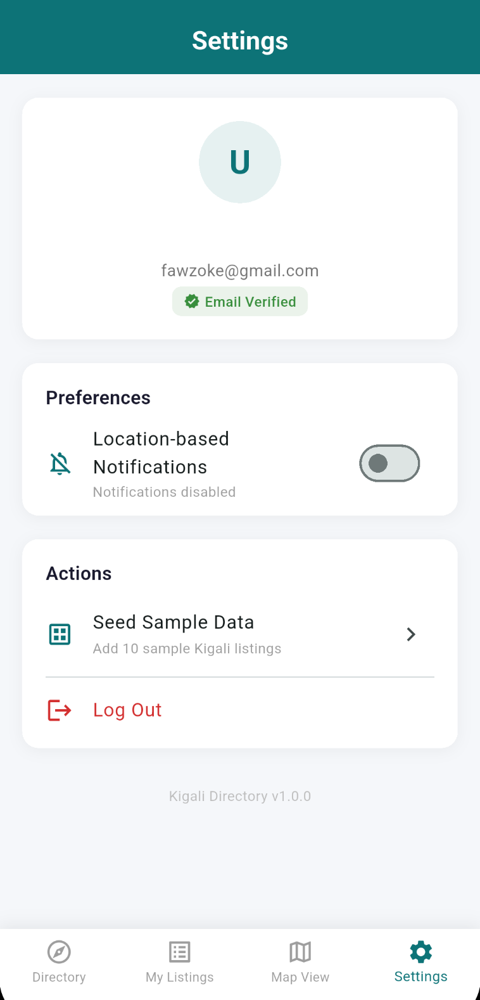
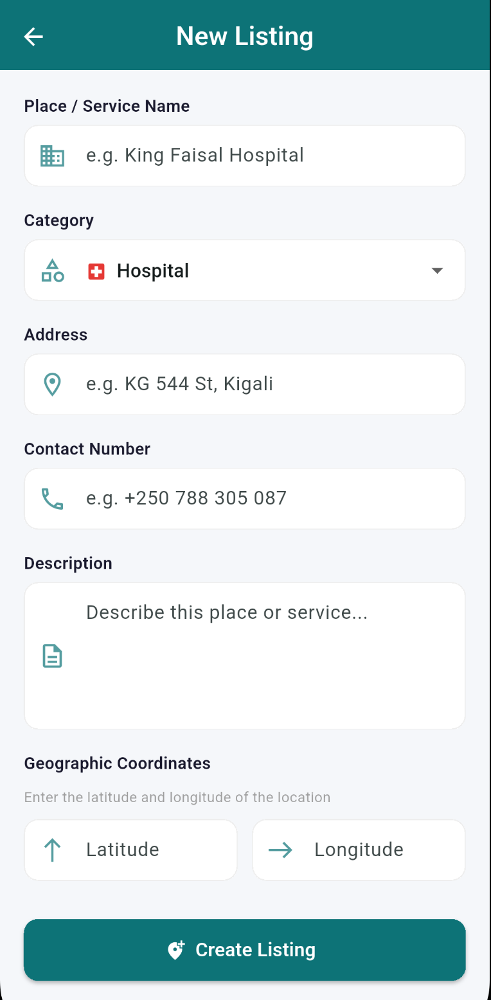

# Kigali City Services & Places Directory

A Flutter mobile application that helps Kigali residents locate and navigate to essential public services and lifestyle locations such as hospitals, police stations, libraries, restaurants, cafés, parks, and tourist attractions.

Built with **Firebase Authentication**, **Cloud Firestore**, **Google Maps**, and **Provider** for state management.

---

## Features

- **Email & Password Authentication** — Signup, login, logout with enforced email verification via Firebase Auth
- **Full CRUD Listings** — Create, read, update, and delete service/place listings stored in Cloud Firestore
- **Real-time Updates** — Firestore streams ensure the UI auto-refreshes when data changes (no manual refresh needed)
- **Search & Filter** — Search listings by name (case-insensitive substring match) and filter by category; both work together
- **Embedded Google Maps** — Detail pages show an interactive map with a marker at the listing's coordinates
- **Turn-by-Turn Navigation** — "Get Directions" button launches Google Maps with navigation to the selected location
- **Full Map View** — A dedicated map screen with color-coded markers for every listing
- **User-Specific Listings** — "My Listings" screen shows only listings created by the authenticated user
- **Settings** — Displays user profile, notification toggle, seed data utility, and logout
- **Seed Data** — One-tap utility to populate Firestore with 10 real Kigali locations for testing

---

## Firestore Database Structure

### `users` Collection

Each document is keyed by the Firebase Auth UID.

| Field         | Type      | Description                          |
|---------------|-----------|--------------------------------------|
| `uid`         | String    | Firebase Auth UID (matches doc ID)   |
| `email`       | String    | User's email address                 |
| `displayName` | String    | User's display name                  |
| `createdAt`   | Timestamp | Account creation timestamp           |

### `listings` Collection

Each document is auto-generated by Firestore.

| Field           | Type      | Description                                              |
|-----------------|-----------|----------------------------------------------------------|
| `name`          | String    | Place or service name                                    |
| `category`      | String    | One of: Hospital, Police Station, Library, Utility Office, Restaurant, Café, Park, Tourist Attraction |
| `address`       | String    | Physical address                                         |
| `contactNumber` | String    | Phone number                                             |
| `description`   | String    | Detailed description of the place/service                |
| `latitude`      | double    | Geographic latitude coordinate                           |
| `longitude`     | double    | Geographic longitude coordinate                          |
| `createdBy`     | String    | UID of the user who created the listing                  |
| `createdAt`     | Timestamp | Document creation timestamp                              |
| `updatedAt`     | Timestamp | Last modification timestamp                              |

### Firestore Security Rules

- **Users**: Can only read/write their own profile document
- **Listings**: Any authenticated user can read all listings and create new ones; only the creator (`createdBy == auth.uid`) can update or delete their own listings

---

## State Management Architecture

This application uses **Provider** with a strict three-layer architecture:

```
┌─────────────────────────────────────────────┐
│                  UI Layer                    │
│    (Screens & Widgets)                      │
│    - Consumer / context.watch / context.read│
│    - ZERO direct Firebase calls             │
├─────────────────────────────────────────────┤
│              Provider Layer                  │
│    (ChangeNotifier classes)                 │
│    - AuthProvider                           │
│    - ListingsProvider                       │
│    - SettingsProvider                       │
│    - Manages loading/success/error states   │
├─────────────────────────────────────────────┤
│              Service Layer                   │
│    (Pure Dart classes)                      │
│    - AuthService       → Firebase Auth      │
│    - FirestoreService  → Cloud Firestore    │
│    - LocationService   → URL Launcher       │
└─────────────────────────────────────────────┘
```

**Data flow for listings:**
1. `FirestoreService` provides Firestore streams and CRUD methods
2. `ListingsProvider` subscribes to streams, exposes state, and delegates CRUD calls to the service
3. UI widgets use `Consumer<ListingsProvider>` to reactively rebuild when state changes

**Data flow for authentication:**
1. `AuthService` wraps all Firebase Auth calls (sign up, sign in, sign out, email verification)
2. `AuthProvider` listens to auth state changes, manages loading/error states, and loads user profiles
3. UI widgets use `Consumer<AuthProvider>` to show appropriate screens and error messages

---

## Folder Structure

```
lib/
├── main.dart                          # App entry point, Firebase init, provider setup
├── firebase_options.dart              # Firebase project configuration (placeholder)
├── models/
│   ├── listing_model.dart             # Listing data model with Firestore serialization
│   └── user_model.dart                # User profile data model
├── services/
│   ├── auth_service.dart              # All Firebase Auth operations
│   ├── firestore_service.dart         # All Firestore CRUD + streams + seed data
│   └── location_service.dart          # URL launcher for map navigation
├── providers/
│   ├── auth_provider.dart             # Auth state management (ChangeNotifier)
│   ├── listings_provider.dart         # Listings state + search/filter (ChangeNotifier)
│   └── settings_provider.dart         # Notification preferences (ChangeNotifier)
├── screens/
│   ├── auth/
│   │   ├── login_screen.dart          # Login form
│   │   ├── signup_screen.dart         # Registration form
│   │   └── email_verification_screen.dart  # Email verification enforcement
│   ├── directory/
│   │   ├── directory_screen.dart      # Browse all listings with search & filter
│   │   └── listing_detail_screen.dart # Detail view with map & directions
│   ├── my_listings/
│   │   ├── my_listings_screen.dart    # User's own listings with edit/delete
│   │   └── add_edit_listing_screen.dart  # Create/edit listing form
│   ├── map/
│   │   └── map_view_screen.dart       # Full-screen map with all markers
│   ├── settings/
│   │   └── settings_screen.dart       # Profile, preferences, logout
│   └── home_screen.dart               # BottomNavigationBar + IndexedStack
├── widgets/
│   ├── listing_card.dart              # Reusable listing card widget
│   ├── category_filter.dart           # Horizontal category filter chips
│   └── search_bar.dart                # Search text field widget
└── utils/
    ├── constants.dart                 # App colors, categories, icons, Firestore refs
    └── validators.dart                # Form validation helpers
```

---

## Setup Instructions

### Prerequisites
- Flutter SDK (3.1.0 or higher)
- Android Studio or VS Code with Flutter extensions
- A Firebase project
- A Google Maps API key

### Step 1: Clone the Repository
```bash
git clone https://github.com/YOUR_USERNAME/kigali-directory.git
cd kigali-directory
```

### Step 2: Set Up Firebase
1. Go to [Firebase Console](https://console.firebase.google.com) and create a new project
2. Enable **Email/Password** authentication under Authentication → Sign-in method
3. Create a **Cloud Firestore** database (start in test mode or deploy the included `firestore.rules`)
4. Register your Android app and download `google-services.json` → place it in `android/app/`
5. Register your iOS app and download `GoogleService-Info.plist` → place it in `ios/Runner/`
6. Install FlutterFire CLI and run:
   ```bash
   dart pub global activate flutterfire_cli
   flutterfire configure --project=YOUR_PROJECT_ID
   ```
   This auto-generates `lib/firebase_options.dart` with your project's values.

### Step 3: Configure Google Maps
1. Go to [Google Cloud Console](https://console.cloud.google.com)
2. Enable the **Maps SDK for Android** and **Maps SDK for iOS**
3. Create an API key

**Android** — Add to `android/app/src/main/AndroidManifest.xml`:
```xml
<meta-data
    android:name="com.google.android.geo.API_KEY"
    android:value="YOUR_GOOGLE_MAPS_API_KEY"/>
```

**iOS** — Add to `ios/Runner/AppDelegate.swift`:
```swift
GMSServices.provideAPIKey("YOUR_GOOGLE_MAPS_API_KEY")
```

### Step 4: Deploy Firestore Rules & Indexes
```bash
firebase deploy --only firestore:rules
firebase deploy --only firestore:indexes
```

### Step 5: Install Dependencies & Run
```bash
flutter pub get
flutter run
```

### Step 6: Seed Sample Data
After logging in, go to **Settings → Seed Sample Data** to populate the database with 10 real Kigali locations.

---

## Firestore Composite Index

The app requires one composite index for the "My Listings" query:
- Collection: `listings`
- Fields: `createdBy` (Ascending) + `createdAt` (Descending)

This index is defined in `firestore.indexes.json` and will be auto-created when you deploy indexes, or Firebase will prompt you with a link in the console error log.

---

## Screenshots

| Login | Directory | Detail + Map | My Listings |
|-------|-----------|-------------|-------------|
|  |  |  |  |

| Map View | Settings | Create Listing | Email Verification |
|----------|----------|---------------|-------------------|
|  |  |  |  |

---

## Technologies Used

- **Flutter** — Cross-platform mobile framework
- **Firebase Auth** — User authentication with email verification
- **Cloud Firestore** — Real-time NoSQL cloud database
- **Google Maps Flutter** — Embedded maps and markers
- **Provider** — State management
- **URL Launcher** — External app launching for navigation
- **intl** — Date formatting

---

## License

This project was created as a university assignment for the Mobile Application Development course.
